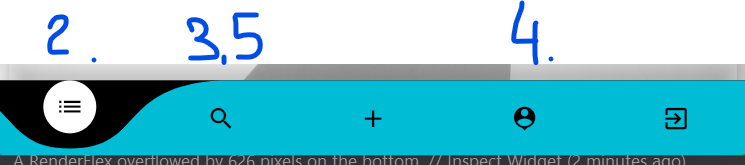

## 
## cpd_ss23
Sehr geehrter Herr Giess,
Hier ist Job Finder App ,  entwickelt von 2020633 und 1920881

## Getting Started

Die von uns entwickelte JobFinder Application verfügt über verschiedene Funktionalitäten, darunter : 
    Login/Logout, 
    Account erstellen/ändern, 
    Job Posten, 
    Kommentieren  
    Bewerben/ Kontakt aufnehmen 

Als Backend haben wir uns für Firebase entschieden: wir wollten die Gelegenheit nutzen, um den Umgang und die Integration von Firebase zu lernen.
## Vorgeschlagene Test flow

1. Erstellen Sie einene Account. Sie müssen nicht unbedingt ein Bild hochladen. Es wird ein Default Bild zugewiesen.
2. Kommentieren/Bewerben Sie sich auf eine offene Jobstelle( zB . n3 Softwareentwickler)
3. Clicken Sie auf Profile eines anderes, der es auch kommentierte 
4. Ändern Sie ihren Account
5. Kontaktieren Sie jmd

Wir haben ein Problem mit dem Bildanzeige in web.
